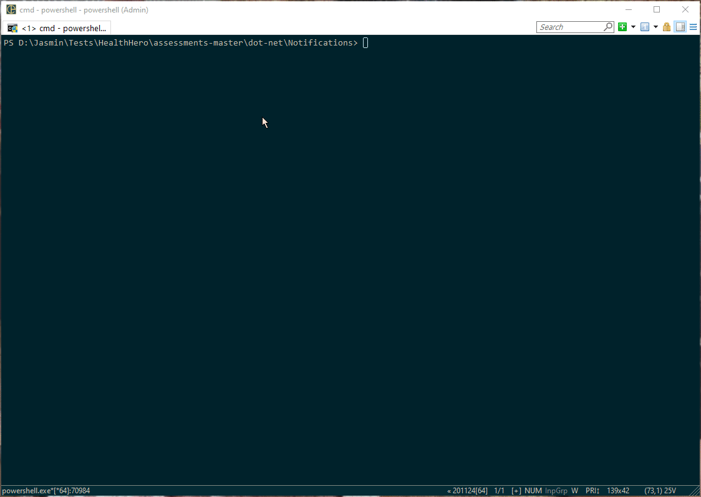
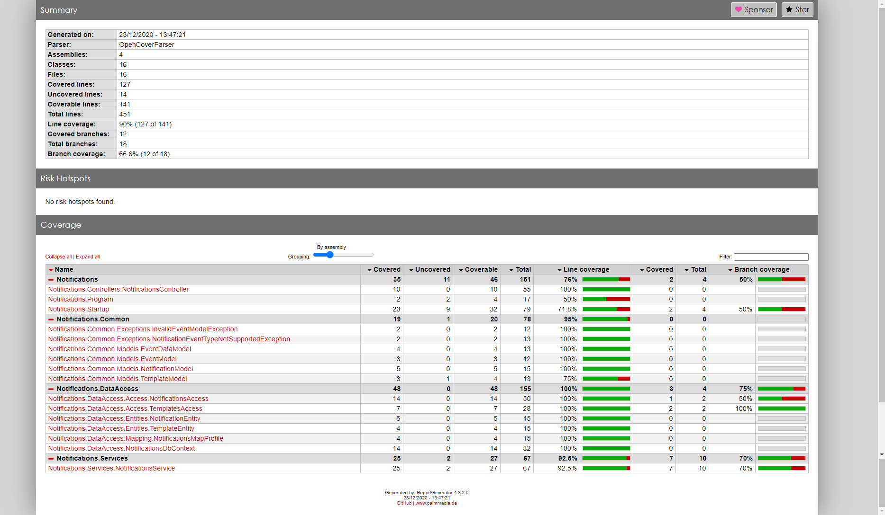

# DoctorLink Assessments

## Assumptions

- `GET /api/notifications` will receive all Notifications stored in the database,
- In `GET /api/notifications/{userId}` api call, userId will be available as part of event notification,
- EventDataModel needs to inherit from IDataModel to allow substitution of template values like FirstName, OrganisationName, AppointmentDateTime and Reason by the TempalteModel itself,
- Notifications will always be added and not updated

## Dev environment (Local) setup

Follow the below steps to setup the local development environment;

1. Create a SQL Server Database called "NotificationsDB",

2. Update the `DefaultConnection` connection string in [appsettings.json](/dot-net/Notifications/Notifications/appsettings.json) to point to database created in step 1,

3. Follow the database migrations command(s) `see` [Database Migration \(using SQL Server\)](#Database-Migration-(using-SQL-Server))

4. To build the solution using PowerShell, run the build.ps1 PowerShell script. `For more info` [Build using PowerShell](#Build-using-PowerShell)

5. To run the Notifications Web API, run the below commands;

   ```powershell
   $ cd "dot-net\Notifications\Notifications"
   $ dotnet run
   ```

   To view Notification API in Swagger UI, open "https://localhost:5001/swagger" on browser

## Pre-requisites

### Database Migration (using SQL Server)

- Running DB Migration via Visual Studio -> Package Manager Console

  `Microsoft.EntityFrameworkCore.Tools` package is already added to the Notifications projects so all commands

  ```powershell
  $ Update-Database
  ```

- Using .NET Core CLI

  Install Entity Framework Core tools using 

  ````powershell
  $ dotnet tool install --global dotnet-ef
  ````

  Run the migration using below commands

  ```powershell
  $ cd "assessments-master\dot-net\Notifications"
  $ dotnet ef database update --project Notifications
  ```

### Database Migration (using In-Memory)

- Remove the `DefaultConnection` connection string from the [appsettings.json](/dot-net/Notifications/Notifications/appsettings.json)

  > Note: Running In-Memory DB won't have the any Templates added to the database so `POST /api/Notificiations` api call would return 400 (Bad Request) with "'AppointmentCancelled' event type is not supported." message.

## Build using PowerShell

Run the below command to build the solution locally;

Execute [build.ps1](/dot-net/Notifications/build.ps1) to compile application and package release artifacts. Outputs to `dot-net/dist/` folder.



#### Code Coverage

The build script also outputs the code coverage result. The coverage report files can be found under `dot-net/dist/Coverage` folder. After the build process is executed you can open the coverage report using `dot-net/dist/Coverage/index.html`



